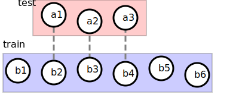

# KNN based model
# Idea
The idea comes from the fact that any routes of a destination passes through similar paths near the destination. Say in other words, anyone going to the entrance of NTU must pass through either Roosevelt‎ Rd. or Xinsheng S. Rd. Hence, by computing the _similarity_ of two taxi routes, we can pick _top N_ training taxi routes which are the most similar to the testing route, and find the most promising destination among the training routes.
In details, we should define the _similarity_ between two routes and find a way to tell the _most promising destination_ among the top N similar routes.

# Implementation
## define the similarity
For any two polylines,  and  where  and  are coordinates consisting of longitude and latitude, and . We define the distance as
 subject to 
where  are the weights

Given the training set of polylines,  and a test polyline . We can pick top N similar polylines similar to , which is .

We can pick the most promising destination by
* the destination of the most similar polyline
* majority voting

